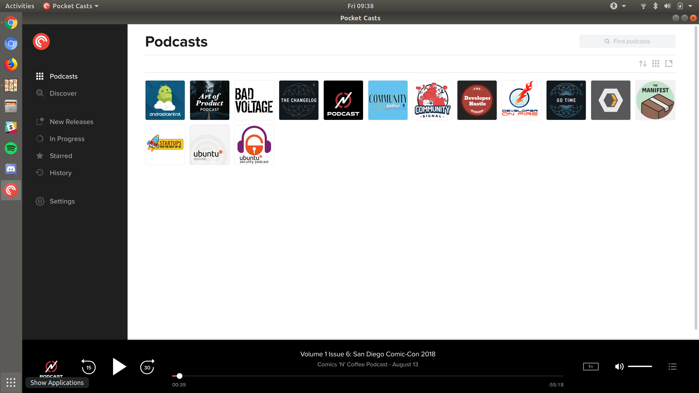

# Pocket Casts Desktop App [](https://circleci.com/gh/felicianotech/pocket-casts-desktop-app) [](https://raw.githubusercontent.com/felicianotech/pocket-casts-desktop-app/master/LICENSE)

Pocket Casts is the world's most powerful podcast player.
It's a great app to discover and listen to your favorite podcasts.
Many blogs have deemed Pocket Casts the best podcatcher around.

This app/repository isn't a new, native app built by the official Pocket Casts team.
Instead, this is a community-built app by me ([@FelicianoTech](https://twitter.com/FelicianoTech)) that takes the official Pocket Casts webapp, and packages for the Linux desktop using Electron (yuck I know, but it actually worked very well).

You need to have a pre-existing Pocket Casts account (it's cheap and worth the money) to use this app.
You can purchase Pocket Casts on their [official website](https://www.pocketcasts.com/).


## Installation

### Snap Package (recommended) - For Ubuntu, most Ubuntu flavors, elementary OS, Debian, Fedora, and more

The Pocket Casts desktop app can be installed via snap on Ubuntu 16.04, Ubuntu 18.04+, elementary OS 5, and many Linux distros with `snapd` installed  by running:

```
sudo snap install pocket-casts
```

If you don't have the `snap` command available, you might be able to find instructions for your distro [here](https://docs.snapcraft.io/core/install).

### Ubuntu Software app

Pocket Casts is available within the Ubuntu Software app on your Ubuntu machine.
Just open the store up and search for "Pocket Casts".

### .deb

We publish a `.deb` file for each release in GitHub Releases.
Check out the [releases page](https://github.com/felicianotech/pocket-casts-desktop-app/releases) to find them.

### macOS

I don't currently publish any packages for macOS.
If you want one, request it in a GitHub Issue (check for an existing issue first) or open a PR.
Since this is built with Electron, it shouldn't be too much extra work to build for macOS if the desire is there.

### Windows

Pocket Casts makes an [official desktop app for Windows](https://www.microsoft.com/en-us/p/pocket-casts-desktop/9pcdbqx582bz?activetab=pivot:overviewtab).
I suggest you use that one.


## Usage



This is a desktop app.
Open whatever app launcher you normally use and search for Pocket Casts.


## Development

This app is built with Electron.
I'm new to using Electron so I'll add more information here as I figure it out.
The snap package itself is built with `electron-builder` so make sure to use that to build your own snap.


## License

The code for this snap is licensed under the MIT license.
This repo's license can be found [here](./LICENSE).
The code for Pocket Casts itself is proprietary and belongs to the Pocket Casts team/NPR.
I do not own that code nor have any affiliation for Pocket Casts.
I'm just a fan of the app and of Linux.
